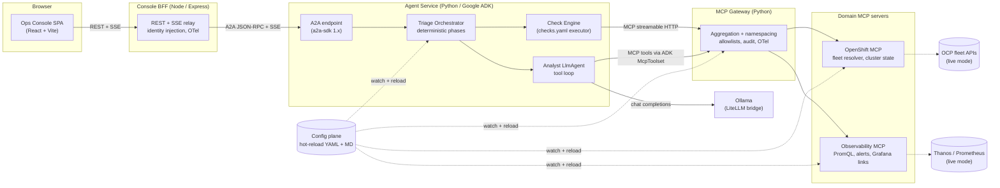
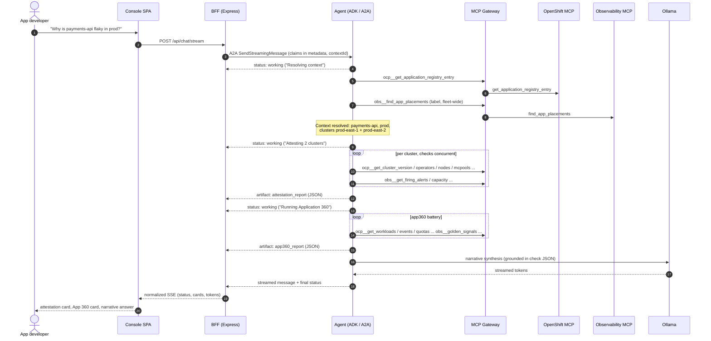
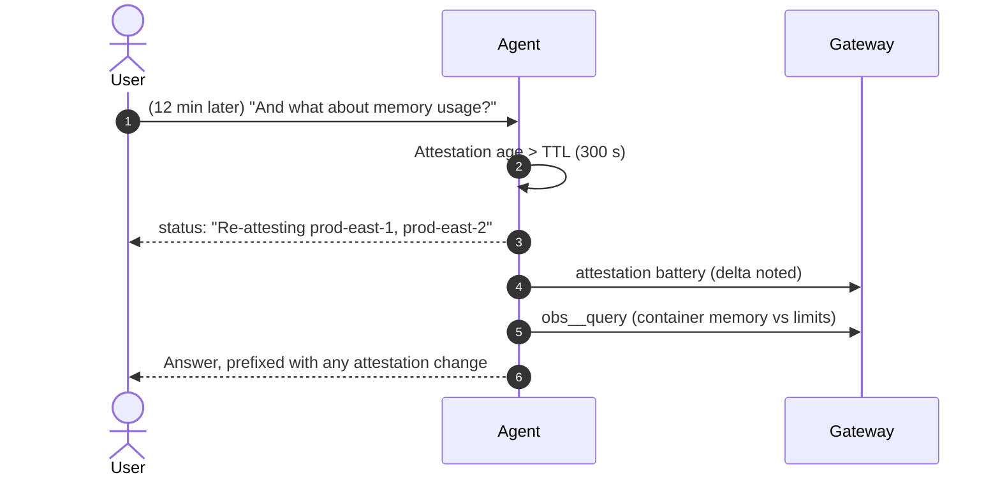
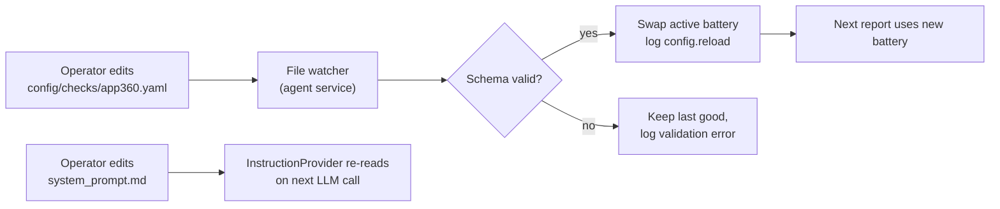
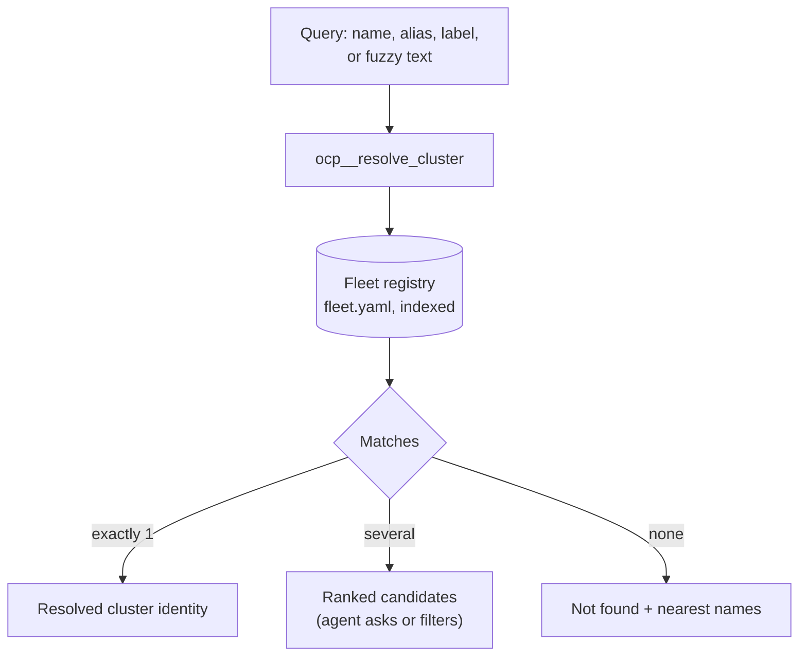

# Cloud Operations Agent - Product Requirements Document

| | |
|---|---|
| Status | Draft v0.1, for review |
| Date | 2026-08-25 |
| Authors | Platform engineering (product owner); drafted with Claude |
| Repo | `Cloud Operations Agent Standalone` |
| Decision needed | Approve scope, architecture, and Decision D1 before the build phase begins |

Requirement keywords MUST, MUST NOT, SHOULD, SHOULD NOT, and MAY are used as defined in RFC 2119.

---

## 1. Summary

The Cloud Operations Agent is an AI-assisted first-level triage system for a fleet of hundreds of OpenShift Container Platform (OCP) clusters.
It answers the question every application team asks first: "is it my app, or is it the platform?"

Every conversation follows a fixed discipline.
The system first attests the health of every in-scope cluster using a deterministic, configurable checklist.
It then resolves who the user is, which applications they own, and where those applications actually run, discovered live from Prometheus rather than assumed.
With context resolved, it automatically produces an Application 360 Report: a deterministic, config-driven battery of checks rendered in the organization's standard 18-section report format.
Only then does the LLM take over for interactive investigation, grounded in the evidence the deterministic phases produced.

The system is built as a small set of composable services: a chat console (Node), an agent service (Python, Google ADK, exposed over A2A), an MCP gateway, and per-domain MCP servers (OpenShift, Grafana/Prometheus).
New cloud domains are added by registering MCP servers and skill files in configuration, with no code changes to the agent core.

## 2. Goals and non-goals

### Goals

1. Reduce time-to-first-signal for application teams from "file a ticket and wait" to under two minutes of self-service.
2. Make platform-vs-application attribution explicit and evidence-backed in every triage session.
3. Encode the organization's existing operations checklist (the 15-category checklist and 18-section Application 360 report) as executable, configurable checks.
4. Prove an extensible architecture where cloud domains are pluggable MCP servers and agent behavior is editable configuration.
5. Run fully local for development: Ollama for inference, mock fleet backends, zero external dependencies.

### Non-goals (for the MVP)

1. No remediation actions. The MVP is strictly read-only diagnostics; write actions (restart, scale, rollback) need approval workflows and are a later phase.
2. No real OAuth flow. Identity is client-supplied in dev; the JWT seam is designed in but not wired to a real IdP.
3. No ticketing/ITSM integration (ServiceNow, incident enrichment). The design leaves seams for it.
4. No multi-agent federation beyond the single triage agent, though A2A makes this a config change later.
5. No fine-tuning or model training. Model quality is a configuration choice.

## 3. Background

The platform organization operates hundreds of OCP clusters across regions and environments.
First-level triage today is human: application teams either page platform SREs or file tickets for symptoms that are frequently platform noise (an upgrade in progress, a node drain, a degraded ingress operator) or self-inflicted application issues that a checklist would catch.

Two internal artifacts define the triage practice this product automates:

1. A "Detailed Operations Checklist" covering 15 categories from application identity through supportability.
2. An "OpenShift Application 360 Report Template" with 18 sections, an executive summary, per-section fact tables, findings notes, recommendations, and a final assessment.

Both artifacts are transcribed verbatim from the supplied document photos, with a per-item accounting of how the MVP covers each of the 161 checklist items, in `docs/reference/source-checklists.md` (rollup in Section 10.3).

The existing "Platform Management - Agentic AI" console (IPE) establishes the UI language: a red masthead, a light card-grid dashboard (incidents, alerts, changes, observability, dependency map), an embedded AI Assistant chat, and a dark log explorer.
This product follows that visual language without depending on that platform.

Industry practice grounds the health attestation design: Red Hat's own troubleshooting order (ClusterVersion, ClusterOperators, nodes, MachineConfigPools, etcd, alerts), kubernetes-mixin alert rules with their hard-won false-positive guards, the Watchdog dead-man's-switch convention, and Google SRE's "platform or app" triage fork.
Section 10 carries the full catalog with sources.

## 4. Personas and user stories

| Persona | Description | Primary need |
|---|---|---|
| App developer | Owns 1-2 applications, limited platform knowledge | "My app is flaky in prod. Is it me or the platform? What do I tell my lead?" |
| SRE / platform engineer | Supports many applications and clusters | Fast, evidence-dense state assessment; skip the basics; compare across clusters |
| New team member | No registered applications yet | Guided onboarding: agent explains what it needs and how to get registered |
| Ops manager | Consumes reports | Standard-format Application 360 reports for review meetings |

Representative stories:

- As an app developer, I ask "why is payments-api slow in prod" and receive, without further prompting: a health verdict for each prod cluster running payments-api, an Application 360 report, and a concrete next step.
- As an SRE, I ask about a cluster directly ("attest prod-east-2") and get the attestation card plus what changed recently.
- As an app developer whose application runs in two environments, I get one clarifying question with the options listed, not a wall of questions.
- As an operator, I add a new check to the App 360 battery by editing a YAML file, and the very next report includes it, with no restart.

## 5. System architecture



### 5.1 Component responsibilities

| Component | Owns | Explicitly does not own |
|---|---|---|
| Ops Console (React SPA) | Chat UX, report cards, context panel, activity log, dev identity picker | Business logic, direct MCP/agent access |
| Console BFF (Express) | Backend-for-frontend: the console's own thin server and the SPA's single origin. A2A client, SSE normalization, identity claim injection, OTel for the web tier | Triage logic, tool execution |
| Agent service (ADK) | Conversation state, deterministic triage phases, check engine, LLM analysis loop, A2A surface | Tool implementations, cluster credentials |
| MCP Gateway | Server registry, tool namespacing (`ocp__*`, `obs__*`), allow/deny policy, per-call audit + telemetry, catalog refresh | Domain logic, check semantics, conversation state |
| OpenShift MCP | Fleet registry + cluster resolution, cluster/app state tools (mock and live backends) | Metric math, report logic |
| Observability MCP | PromQL/Thanos queries, firing alerts, app discovery by label, Grafana deep links | Cluster API access |
| Config plane | Prompts, routing, skills, check batteries, fleet registry, app registry, identities, gateway policy | Secrets (env-only) |

### 5.2 Technology stack (verified current versions)

| Layer | Choice | Pin |
|---|---|---|
| Agent framework | Google ADK (Python) | `google-adk==2.7.1` (Python >= 3.10; local 3.12) |
| Agent protocol | A2A via ADK `to_a2a()` | `a2a-sdk[http-server]==1.1.2` (A2A 1.0 + 0.3 compat) |
| Inference | Ollama via LiteLLM (`ollama_chat/<model>`) | `litellm==1.98.0`, default model `qwen3:4b` |
| MCP | Official Python SDK v2 | `mcp==2.1.1` (MCPServer + low-level `Server` gateway) |
| Frontend | React + Vite SPA, Express BFF | Node 22, TypeScript |
| Telemetry | OpenTelemetry traces + structured logs | Python OTel `<=1.42.1` (ADK constraint), OTel JS SDK |
| Packaging | uv (Python workspace), npm workspaces (Node) | uv 0.8.x |

Notable API facts the implementation will rely on (verified against source during research):

- ADK `LlmAgent.instruction` accepts a callable invoked per-request, which is the hot-reload mechanism for prompts.
- ADK `McpToolset` supports `StreamableHTTPConnectionParams` plus a per-invocation `header_provider`, used to forward the thread id and user claims to the gateway.
- A2A `contextId` maps directly to the ADK session id, giving durable per-thread state.
- A2A request-level `params.metadata` surfaces in the agent as `ctx.run_config.custom_metadata["a2a_metadata"]`, the identity-claim channel.
- MCP v2 low-level `Server` re-exposes downstream tools with original schemas verbatim (`on_list_tools` / `on_call_tool`), the verified gateway pattern.

## 6. Key decisions

### D1. Where does mandatory health attestation live? (decision requested by product owner)

Options considered:

| Option | Description | Assessment |
|---|---|---|
| A. Prompt-only | Instruct the LLM to always attest first | Rejected. Non-deterministic; a local model will skip or reorder steps; unverifiable guarantee |
| B. MCP gateway enforcement | Gateway blocks/injects checks before tool traffic | Rejected for MVP. Couples the domain-agnostic gateway to OpenShift semantics; gateway lacks conversation state (which clusters are in scope for this user); breaks the 1:many pluggable-domain story |
| C. Agent-runtime deterministic phase (recommended) | A coded orchestrator phase in the agent service runs the attestation battery before the LLM analysis loop; the battery itself is configuration | Accepted. Deterministic and testable without an LLM; has full conversation context; keeps the gateway policy-neutral; checks remain config-editable |

**Recommendation: Option C.**
The agent's root agent is a custom deterministic orchestrator (ADK `BaseAgent` subclass), not a bare LLM loop.
Its phases (context resolution, attestation, App 360, then LLM analysis) are code; the content of each phase (which checks, which tools, what thresholds) is configuration.
The gateway still enforces cross-cutting guardrails (tool allowlists, timeouts, audit), which is its proper policy role.
Revisit trigger: if multiple heterogeneous agents must share identical attestation semantics, promote the check engine into a shared library or a dedicated "checks" MCP server, not into the gateway.

### D2. Gateway is a pure aggregation and policy plane

The gateway connects to N registered MCP servers (config: `servers.yaml`), re-exposes their tools namespaced as `<prefix>__<tool>` with schemas passed through verbatim, enforces allow/deny lists and timeouts, emits audit records and OTel spans per call, and refreshes catalogs on downstream `tools/list_changed`.
It MUST NOT contain domain logic or conversation state.
This is what makes "add a cloud domain" equal "add an MCP server entry in config".

### D3. Checks are data, not code

Both check batteries (attestation, App 360) are YAML documents.
A check names a gateway tool, templated arguments (`{{ cluster }}`, `{{ namespace }}`, `{{ app_label }}`), declarative evaluation rules over the tool's structured result (path, operator, threshold, verdict, reason), a severity, and an optional runbook URL.
The check engine executes them deterministically and produces a typed report consumed by both the UI (report cards) and the LLM (narrative grounding).
Adding, removing, or re-tuning a check is a config edit, hot-reloaded, no restart.

### D4. A2A is the agent boundary

The agent service is exposed exclusively over A2A (ADK `to_a2a()`).
The BFF is an A2A client; the A2A `contextId` is the conversation thread id end to end (UI, logs, traces, ADK session).
This buys protocol-standard streaming (status updates, artifacts), future multi-agent composition, and zero custom wire formats.

### D5. Identity is client-derived, verified at the BFF seam

Dev mode: the console offers an identity picker over `config/identity/users.yaml`; the BFF stamps the selected user's claims into A2A request metadata.
Production mode (designed, not built in MVP): the BFF validates an OAuth JWT (JWKS), derives the same claim shape (`sub`, `email`, `groups`), and stamps that.
The agent treats claims as trusted input from its BFF; the trust boundary and its production hardening live in one place.
User-to-application mapping resolves through the application registry (`applications.yaml`) by owner group; workload placement is discovered live from Prometheus, never assumed from the registry.

### D6. Mock-first backends with identical tool contracts

Every MCP tool has a mock backend (deterministic synthetic fleet with scripted faults, shared world-state between the OpenShift and observability servers) and a live backend (real cluster APIs / Thanos).
Selection is `CLOUDOPS_BACKEND_MODE=mock|live`.
Tool schemas and result shapes are identical in both modes, so the agent, checks, and UI cannot tell the difference.
This makes the MVP demoable on a laptop and makes E2E tests hermetic.

### D7. Frontend is React + Vite (open question 1)

"Node frontend" is satisfied by a React SPA served by the Express BFF.
The SSOP prototype used Angular 20 + Material; if organizational alignment matters more than iteration speed, the BFF/A2A seam is framework-agnostic and the console can be rebuilt in Angular without touching any other component.
Flagged as open question 1.

### D8. Default model is qwen3:4b, quality escalation is config

`qwen3:4b` (installed) is the default for iteration speed; `gpt-oss:20b` (installed) is the recommended quality escalation; both support tool calling through `ollama_chat/`.
Model, temperature, and loop budget live in `models.yaml`, hot-reloaded.

## 7. Functional requirements

### 7.1 Context resolution (FR-CTX)

- FR-CTX-1. The system MUST resolve, per conversation: user identity, candidate applications, and the clusters plus namespaces where those applications run.
- FR-CTX-2. Workload placement MUST be discovered by querying Prometheus label series (`kube_pod_labels` joined on the fleet `cluster` label), not read from static registry hints.
- FR-CTX-3. When context is unambiguous, the agent MUST proceed without asking questions.
- FR-CTX-4. When context is ambiguous (multiple applications or environments), the agent MUST ask exactly one clarifying question per turn, enumerating the options.
- FR-CTX-5. If the user has no registered applications, the agent MUST explain the registration path and MAY proceed on a user-named application.
- FR-CTX-6. Resolved context MUST be visible to the user in a console panel (who, applications, clusters, namespaces) and stored in session state.
- FR-CTX-7. The user MUST be able to override resolved context conversationally ("look at the dev instance instead").

### 7.2 Cluster health attestation (FR-ATT)

- FR-ATT-1. Before any application-level analysis in a conversation, the agent runtime MUST execute the attestation battery against every in-scope cluster.
- FR-ATT-2. The battery MUST be defined in `config/checks/health_attestation.yaml` and hot-reload on save.
- FR-ATT-3. Each cluster attestation MUST produce a verdict from: `healthy`, `degraded`, `maintenance`, `unattestable`.
- FR-ATT-4. Maintenance detection MUST combine ClusterVersion `Progressing`, MachineConfigPool `Updating`/paused, and cordoned-node signals, so expected upgrade noise is not reported as failure.
- FR-ATT-5. `unattestable` MUST be returned when the monitoring pipeline itself cannot be trusted (Watchdog alert absent, monitoring operator degraded, or stale fleet metrics), and MUST be presented distinctly from `degraded`.
- FR-ATT-6. Attestation results MUST carry per-check evidence (tool, query, observed value, threshold, severity, optional runbook URL).
- FR-ATT-7. Attestation results MUST be cached per thread with a configurable TTL (`models.yaml: agent.attestation_ttl_seconds`); the runtime MUST re-attest when stale before answering further questions.
- FR-ATT-8. The attestation MUST render in the console as a structured card (per-cluster verdict grid), independent of the LLM narrative.
- FR-ATT-9. The attestation card MUST expand per cluster into a detailed attestation: every battery check as a status row, passes included, each opening to its evidence under the same drill-down contract as FR-UI-7; the attestation artifact MUST embed those per-check results (same shape as FR-360-9) and MUST be exportable like the Application 360 report.

### 7.3 Application 360 report (FR-360)

- FR-360-1. Once context is resolved, the agent MUST automatically run the Application 360 battery (configurable off via `agent.auto_app360`).
- FR-360-2. The battery MUST be defined in `config/checks/app360.yaml`, organized in the organization's checklist categories, and hot-reload on save.
- FR-360-3. The rendered report MUST follow the organization's 18-section Application 360 template: executive summary, per-section fact tables, per-section findings, recommendations, final assessment.
- FR-360-4. Deterministic checks MUST populate all fact tables; the LLM MUST author only the narrative fields (summary, findings prose, recommendations, final assessment) and MUST ground them in check results.
- FR-360-5. Overall status MUST map deterministically: any failed critical check yields `Critical`; any failed or warning check yields `At Risk`; otherwise `Healthy`.
- FR-360-6. Sections whose data source is not yet automated MUST render as `manual` or `registry` sourced rather than silently disappearing.
- FR-360-7. The report MUST be exportable (Markdown download in MVP).
- FR-360-8. When the same application runs in multiple in-scope instances (cluster, namespace pairs), the report MUST cover each instance or state which instance it covers.
- FR-360-9. The report artifact MUST embed the underlying per-check results (id, section, status, observed value, threshold, evidence, runbook URL) so clients can render check-level drill-down without re-querying.

### 7.4 Conversation and analysis (FR-CHAT)

- FR-CHAT-1. After the deterministic phases, the agent MUST support free-form investigation using gateway tools through the LLM loop.
- FR-CHAT-2. The agent MUST NOT assert facts about fleet state that are not backed by a tool result from the current conversation.
- FR-CHAT-3. The agent MUST distinguish platform-attributable from application-attributable findings in its answers, and recommend escalation with an evidence list when platform-attributable.
- FR-CHAT-4. Responses MUST stream token-by-token, with phase/status updates surfaced during long operations.
- FR-CHAT-5. The tool loop MUST respect `agent.max_tool_iterations` per turn.
- FR-CHAT-6. The agent MUST be read-only; it MUST NOT claim to have performed mutations.

### 7.5 MCP gateway (FR-GW)

- FR-GW-1. The gateway MUST aggregate N downstream MCP servers from `config/gateway/servers.yaml` behind one streamable-HTTP MCP endpoint.
- FR-GW-2. Tools MUST be namespaced `<prefix>__<tool>` with downstream input/output schemas passed through unmodified.
- FR-GW-3. The gateway MUST enforce per-server tool allowlists and a global denylist from config, refusing unlisted tools.
- FR-GW-4. The gateway MUST hot-reload the server registry: adding/enabling/disabling a server converges without gateway restart.
- FR-GW-5. Every proxied call MUST produce an audit record (timestamp, thread id, tool, duration, outcome; arguments summarized with redaction) and an OTel span linked to the caller's trace.
- FR-GW-6. Downstream failures MUST return structured MCP tool errors (`is_error=true`), never crash the gateway session, and MUST be supervised with reconnect.
- FR-GW-7. Per-call timeout MUST be configurable; the gateway MUST cancel and report tools that exceed it.

### 7.6 Domain MCP servers (FR-MCP)

- FR-MCP-1. The OpenShift MCP MUST expose a fleet resolver: given a name, alias, label selector, or fuzzy query, return matching cluster identities from the fleet registry, with paging suitable for hundreds of clusters.
- FR-MCP-2. Every cluster-scoped tool MUST take an explicit resolved cluster name; tools MUST NOT guess clusters.
- FR-MCP-3. The OpenShift MCP MUST expose (mock and live): cluster info/version, cluster operators, nodes, machine config pools, pending CSRs, namespace workloads (deployments, statefulsets, pods with container states), recent warning events, namespace quotas/limits, routes/services with TLS metadata, PVCs, and the application registry entry.
- FR-MCP-4. The observability MCP MUST expose (mock and live): instant and range PromQL, app placement discovery by label across the fleet, firing alerts (filterable by cluster/namespace/severity, Watchdog visible), golden-signal summaries for a workload, capacity/saturation summaries per cluster, and Grafana dashboard deep links.
- FR-MCP-5. All tools MUST return structured content (typed result schemas), designed for both rule-engine paths and LLM consumption (compact, pre-summarized where cardinality is high).
- FR-MCP-6. Mock backends MUST derive from one shared synthetic world state (fleet registry plus `config/mock/scenario.yaml` fault script) so both servers tell one consistent story.
- FR-MCP-7. Live backends MUST authenticate from environment/secret-store material only, never from committed config.

### 7.7 Configuration plane (FR-CFG)

- FR-CFG-1. All prompts, routing instructions, skills, check batteries, fleet registry, application registry, identities, gateway policy, and model settings MUST live under `config/` as YAML or Markdown.
- FR-CFG-2. Config changes MUST take effect without service restarts: prompt files are re-read per LLM invocation; YAML registries reload on file-watch events; the next operation uses the new values.
- FR-CFG-3. Invalid config edits MUST NOT crash services: the last known good version stays active and the validation error is logged and surfaced.
- FR-CFG-4. Config MUST NOT contain secrets; secrets come from environment variables (or a secret store in production) and are referenced, not embedded.
- FR-CFG-5. Environment variable interpolation (`${VAR}` with defaults) MUST be supported in YAML config values.

### 7.8 Console UI (FR-UI)

- FR-UI-1. The console MUST provide: a chat panel (streaming markdown), a context panel (user, applications, clusters/namespaces), an attestation card per cluster, the Application 360 report card, and an activity log of agent phases and tool calls.
- FR-UI-2. Structured cards MUST render from typed A2A artifacts (JSON parts), not parsed from LLM prose.
- FR-UI-3. Visual language MUST follow the IPE console direction: red masthead with gold rule, light card grid, status pills, tabs, dark log panel; all colors and fonts MUST be centralized as design tokens for later rebranding.
- FR-UI-4. The dev identity picker MUST be visible only in dev mode.
- FR-UI-5. Clarification requests (A2A `input-required`) MUST render as normal chat turns with quick-pick options.
- FR-UI-6. The UI MUST remain a thin client: no triage logic, no direct MCP access.
- FR-UI-7. Report cards MUST render per-check status rows (healthy / warning / failing / maintenance / manual / registry) that expand in place to show the check's evidence: tool called, arguments, observed value versus threshold, timestamp, and runbook link.

### 7.9 Identity (FR-ID)

- FR-ID-1. The BFF MUST attach identity claims (`sub`, `name`, `email`, `groups`) to every A2A request as request-level metadata.
- FR-ID-2. In dev mode claims come from the identity picker backed by `config/identity/users.yaml`.
- FR-ID-3. The production seam MUST be a single BFF middleware that validates a bearer JWT against configurable JWKS and emits the same claim shape (implementation in a later phase; interface in MVP).
- FR-ID-4. The agent MUST treat absent/malformed claims as an unauthenticated session and respond with onboarding guidance instead of running checks.

## 8. Non-functional requirements

### 8.1 Observability (NFR-OBS)

- NFR-OBS-1. All five services MUST emit OpenTelemetry traces; one user turn MUST form one distributed trace: console action, BFF relay, A2A handling, orchestrator phases, each check, each gateway proxy hop, each MCP tool execution, each LLM call.
- NFR-OBS-2. The conversation thread id (A2A `contextId`) MUST be attached to every span (`thread.id`) and propagated cross-service via W3C `traceparent` plus `baggage`, so a whole conversation is queryable in one filter.
- NFR-OBS-3. Logs MUST be structured (JSON in prod, pretty in dev) and MUST carry `trace_id`, `span_id`, and `thread.id` for log-trace correlation.
- NFR-OBS-4. Exporters MUST be optional: with no `OTEL_EXPORTER_OTLP_ENDPOINT` set, services run with local-only tracing and full log correlation; with it set, OTLP export works out of the box (a compose file provides a collector plus Jaeger for local use).
- NFR-OBS-5. Key operations MUST emit metrics-friendly span attributes: check id and verdict, tool name, model name, token counts where available, durations.

### 8.2 Logging hygiene and secrets (NFR-LOG)

- NFR-LOG-1. A shared redaction layer MUST scrub known secret patterns (bearer tokens, `Authorization` headers, kubeconfig contents, PEM blocks, password/token/key fields) from logs, audit records, and error messages in both Python and Node tiers.
- NFR-LOG-2. Stack traces MUST NOT be returned to clients; clients receive a correlation id plus a generic message, and the full trace goes to server logs at error level.
- NFR-LOG-3. Secret values MUST NOT appear in spans, spans' attributes, audit records, or check evidence; secrets are referenced by name only (this includes the agent narrating Kubernetes Secret contents, which tool results MUST NOT contain).
- NFR-LOG-4. Log level MUST be config-driven per service (`CLOUDOPS_LOG_LEVEL`).

### 8.3 Security (NFR-SEC)

- NFR-SEC-1. MVP tool surface MUST be read-only against all backends.
- NFR-SEC-2. Live-mode credentials MUST come from environment/secret store; mock mode MUST require no credentials.
- NFR-SEC-3. The gateway allowlist MUST be the single choke point deciding which tools any agent can reach.
- NFR-SEC-4. Services MUST bind to localhost by default in dev.
- NFR-SEC-5. Prompt-injection posture: tool results are data; the agent's system prompt MUST instruct against executing instructions embedded in cluster data (pod names, annotations, log lines), and report rendering MUST escape all tool-derived strings.

### 8.4 Performance (NFR-PERF)

- NFR-PERF-1. Deterministic phases (attestation plus App 360, mock mode) SHOULD complete in under 10 seconds for a two-cluster scope, with checks executed concurrently per cluster.
- NFR-PERF-2. First streamed token after a user message SHOULD arrive within 2 seconds on `qwen3:4b` (excluding deterministic phase time, which streams progress updates meanwhile).
- NFR-PERF-3. Fleet resolution MUST stay responsive at 500 registered clusters (indexed in-memory registry).

### 8.5 Extensibility (NFR-EXT)

- NFR-EXT-1. Adding a cloud domain MUST require only: a new MCP server (any language), one `servers.yaml` entry, optional checks and one skill file; zero agent/gateway code changes.
- NFR-EXT-2. Check schema and report schema MUST be versioned (`version:` field) with backward-compatible evolution.
- NFR-EXT-3. The A2A surface MUST remain standard so other clients (CLI, ChatOps) can attach without the console.

### 8.6 Quality engineering (NFR-QE)

- NFR-QE-1. Python services MUST have unit tests for the check engine, config loader, redaction, and fleet resolver; an E2E test MUST run the full mock-mode triage flow headlessly.
- NFR-QE-2. Lint and type checks MUST pass clean (ruff + mypy for Python, eslint + tsc for Node).
- NFR-QE-3. Code MUST be commented for maintainers and coding agents: module headers stating role and seams, non-obvious constraints inline.

## 9. Key flows

### 9.1 First-contact triage



### 9.2 Clarification (ambiguous context)

```mermaid
sequenceDiagram
  autonumber
  actor U as SRE (6 apps)
  participant A as Agent
  U->>A: "Is my stuff healthy?"
  A->>A: Context resolution: 6 candidate apps
  A-->>U: input-required: "Which application? 1. checkout 2. loyalty ..."
  U->>A: "checkout, prod"
  A->>A: Context resolved; attestation + App 360 proceed
  A-->>U: Reports + narrative
```

### 9.3 Follow-up with stale attestation



### 9.4 Config hot reload



### 9.5 Fleet cluster resolution



## 10. Check catalogs

### 10.1 Cluster health attestation battery (defaults)

Grounded in Red Hat troubleshooting order, kubernetes-mixin rules, and OpenShift runbooks; each check carries its evidence and a runbook URL in config.

| # | Check | Source of truth | Healthy criteria | On breach |
|---|---|---|---|---|
| 1 | API reachability | cluster info tool | API responds | fail (critical) |
| 2 | ClusterVersion | `Available/Progressing/Failing` conditions | Available, not Failing; Progressing implies `maintenance` | fail / maintenance |
| 3 | ClusterOperators | per-operator `Available/Progressing/Degraded` | none Degraded, all Available; weight etcd, kube-apiserver, ingress, dns, auth, monitoring as critical | fail (critical operators) / warn |
| 4 | Nodes | `Ready`, pressure conditions, `unschedulable` | all Ready, no pressure; cordoned nodes counted as maintenance signal (mixin KubeNodeNotReady excludes cordoned) | fail / warn / maintenance |
| 5 | MachineConfigPools | `Updated/Updating/Degraded`, paused | Updated, not Degraded; Updating implies `maintenance`; long-paused pools warn | fail / warn / maintenance |
| 6 | etcd | operator conditions + alerts (`etcdNoLeader`, `etcdHighFsyncDurations`, members) | leader present, quorum, no fsync alerts | fail (critical) |
| 7 | Firing alerts | `ALERTS{alertstate="firing"}` | zero critical (Watchdog excluded from breaches) | fail / warn by severity |
| 8 | Watchdog present | `ALERTS{alertname="Watchdog"}` | firing (dead man's switch) | `unattestable` if absent |
| 9 | API server SLO | error rate / burn rate | 5xx ratio under threshold | warn / fail |
| 10 | Capacity | requests vs allocatable (CPU, memory), pod count vs capacity | fits allocatable minus one node (overcommit guard) | warn |
| 11 | Pending CSRs | CSR list | zero pending | warn |
| 12 | Cert expiry signals | cert expiration alerts | none | warn / fail |

Verdict precedence per cluster: any `unattestable` signal caps confidence and is reported first; else any critical fail yields `degraded`; else maintenance signals yield `maintenance`; else `healthy`.
False-positive guards from kubernetes-mixin (rollout-in-progress guards, Jobs excluded from pod checks, HPA min==max exclusion) are encoded in the default rules.

### 10.2 Application 360 battery (mapped to the 18-section template)

| Template section | Data source | MVP automation |
|---|---|---|
| 1. Executive summary | LLM narrative over all checks | automated (narrative) |
| 2. Application identity | application registry + resolved context | automated (registry) |
| 3. Deployment overview | `ocp__get_workloads` (replicas, strategy, images, rollout, age) | automated |
| 4. Runtime health | pod states, waiting/terminated reasons, restarts, probes, usage vs limits | automated |
| 5. Configuration | ConfigMap/Secret names (names only), env source refs, mounts | automated (metadata only) |
| 6. Networking | services, routes, TLS termination, NetworkPolicy presence, DNS status | automated (mock: static; live: partial) |
| 7. Storage and data | PVC binding, capacity usage, growth trend; backup fields from registry | automated + registry |
| 8. Security posture | ServiceAccount, SCC/PSA flags, route TLS cert expiry | partial; image vulns marked manual |
| 9. Observability | firing alerts, error rate, latency, dashboards, log availability | automated |
| 10. Dependency health | registry-declared dependencies + reachability signals where measurable | registry + partial |
| 11. Cluster and platform context | attestation summary for hosting cluster, quotas, scheduling pressure | automated (reuses attestation) |
| 12. Capacity and performance | requests vs limits vs usage, throttling, HPA state | automated |
| 13. Release and change history | rollout history, image digest change times | partial (no ITSM in MVP) |
| 14. Reliability and recovery | PDB status; RPO/RTO and backup policy from registry | registry + partial |
| 15. Operational risks | derived: expiring certs, deprecated APIs flagged manual | partial |
| 16. Supportability and ownership | registry (owners, on-call, runbooks, escalation) | automated (registry) |
| 17. Recommendations | LLM narrative, grounded | automated (narrative) |
| 18. Final assessment | deterministic status mapping + LLM reason | automated |

### 10.3 Coverage against the source operations checklist

The internal 15-category checklist (161 items) and the report template are transcribed verbatim, with a coverage tag on every item, in `docs/reference/source-checklists.md`.
The rollup:

| Coverage | Items | Share | Meaning |
|---|---|---|---|
| auto | 92 | 57% | Deterministic MCP-tool checks in the MVP batteries |
| registry | 27 | 17% | Application registry fields (owners, SLA, backup policy, runbooks) |
| llm | 3 | 2% | Grounded narrative (failure impact, SPOF reasoning, risk ranking) |
| manual | 14 | 9% | Rendered as manual fields awaiting human input |
| M3 | 12 | 7% | Live-mode probes: connectivity, drift diffs, deprecation signals |
| M4 | 13 | 8% | Needs ITSM, vulnerability scanners, feature-flag or backup systems |

No item is silently dropped: everything renders in the report with its source tag (FR-360-6).
Known transcription gaps: the template's section 12 field list is cut mid-table in the photos, and sections 13-15 field pages were not captured; their batteries derive from checklist categories 12-14 until those pages are supplied.

## 11. Report formats

The Application 360 Report renders exactly in the organization's template structure: an executive summary block (application, namespace, cluster, environment, owners, report date, overall status pill, 1-3 sentence summary), one fact table per section (`Item | Value` with status pills), a findings note per section, numbered recommendations, and a final assessment (status, reason, next review date).
The attestation card renders one row per cluster: verdict pill (`healthy` green, `maintenance` blue, `degraded` red, `unattestable` amber), the failing/maintenance signals, and timestamps.
Each cluster row expands into the detailed attestation: all battery checks as status rows, passed checks included, each opening to its evidence, so a "healthy" verdict is itself auditable check by check (FR-ATT-9).
Narrative text in chat follows the IPE incident-summary idiom: Summary, Impact Assessment, Root Cause Indicators, Next Steps.
Each report section carries its individual check rows: collapsed, a row shows the check name, status pill, and observed value; expanded, it reveals the evidence trail (tool, arguments, observed value versus threshold, timestamp, runbook link) per FR-360-9 and FR-UI-7.
All three are delivered as typed JSON artifacts over A2A and rendered client-side; Markdown export mirrors the same structure.

## 12. Configuration plane layout

```
config/
  models.yaml                  # inference + agent loop tuning
  agent/
    agent.yaml                 # prompt composition, skill toggles, context policy
    system_prompt.md           # persona and hard rules
    routing.md                 # the triage flow contract
    skills/                    # focused how-to blocks, hot-toggleable
      cluster-health-triage.md
      app360-analysis.md
      prometheus-query-crafting.md
    templates/
      app360_report.md         # 18-section render template
  checks/
    health_attestation.yaml    # battery: tools, args, rules, severities, runbooks
    app360.yaml                # battery grouped by template sections
  gateway/
    servers.yaml               # registered MCP servers, prefixes, allowlists, timeouts
  fleet/
    fleet.yaml                 # cluster registry (+ synthetic generator for scale testing)
    applications.yaml          # application registry: owners, labels, SLO, runbooks
  identity/
    users.yaml                 # dev personas (JWT claim shape)
  mock/
    scenario.yaml              # mock world: placements and scripted faults
```

Hot-reload semantics: Markdown prompt files re-read at each LLM invocation; YAML files watched and atomically swapped after schema validation; invalid edits keep last-known-good and surface the error (FR-CFG-3).

## 13. Telemetry specification

Span model for one turn (names illustrative):

```
console.turn (SPA)
  bff.chat_stream                      thread.id=ctx-42 user.sub=app-developer
    a2a.send_streaming_message
      agent.orchestrate
        agent.phase.context_resolution
          gateway.call ocp__resolve_cluster
            mcp.tool resolve_cluster
        agent.phase.attestation cluster=prod-east-2
          check.run id=cluster-operators verdict=fail
            gateway.call ocp__get_cluster_operators
        agent.phase.app360 ...
        agent.phase.narrative
          llm.generate model=ollama/qwen3:4b
```

Propagation: W3C `traceparent` headers at every HTTP hop (BFF to A2A, agent to gateway via `McpToolset` headers, gateway to MCP servers); `baggage` carries `thread.id` and `user.sub` so leaf services log them without plumbing.
Logs: structlog (Python) and pino (Node), JSON in prod, both injected with `trace_id`/`span_id`/`thread.id`; the gateway additionally writes an audit stream.
ADK's built-in GenAI spans are enabled via its OTel setup hook; Python OTel is pinned `<=1.42.1` per ADK constraint.

## 14. UI design direction

Layout (desktop-first, from the IPE screenshots):

- Masthead: deep red band, product title left, signed-in identity right, thin gold rule beneath.
- Left rail: context card (user, applications, environment), cluster attestation card (verdict pills per cluster).
- Center: AI Assistant chat (streaming markdown, clarification quick-picks, report cards inline).
- Right/expandable: Application 360 report panel (18 sections, collapsible, status pills), activity log panel (dark, monospace, phase and tool-call lines).
- Status pills throughout: green healthy/active, blue maintenance/in-progress, amber warning/unattestable, red degraded/critical, gray unknown.

All colors, spacing, and type ship as CSS design tokens in one file; the IPE-like palette is the default theme and rebranding is a token edit.
No Wells Fargo marks, names, or proprietary assets are used.

## 15. MVP scope

### In scope

1. Full mock-mode E2E: console, BFF, agent (ADK + A2A), gateway, two MCP servers, Ollama inference.
2. Deterministic attestation + App 360 with the default batteries; hot-reloadable everything (Section 12).
3. Context resolution with the four dev personas (single-app, multi-app, no-app, SRE) and clarification flow.
4. Typed report cards + Markdown export; activity log; OTel end to end; redaction layer; unit + E2E tests per NFR-QE.
5. Live-mode backend interfaces implemented with a working single-cluster happy path (guarded by config), exercised against a real cluster only if one is available.

### Out of scope (phased next)

- Real OAuth/JWT validation (Phase M3), ITSM/incident ingestion (M4), remediation actions with approvals (M4), additional domains (AWS/Azure MCPs) (M4), Grafana embedded panels (M3), multi-agent A2A federation (M5).

### Acceptance criteria (demo script)

1. `make setup && make dev` brings up the full stack locally with only Ollama as a prerequisite.
2. As the app-developer persona: "why is payments-api flaky in prod?" yields, in one turn: resolved context in the panel, two cluster attestations (one healthy, one degraded ingress with node maintenance), an 18-section App 360 report with a crashloop finding, and a grounded narrative with a next step, streamed live.
3. As the SRE persona (6 apps): the agent asks exactly one clarifying question with options.
4. As the new-joiner persona (no apps): onboarding guidance, no checks executed.
5. Editing `system_prompt.md` changes agent behavior on the next message, no restart.
6. Removing a check from `app360.yaml` removes it from the next report, no restart.
7. One Jaeger trace shows the whole turn across all five services with `thread.id` on every span; grepping logs for a canary secret planted in env yields nothing.
8. All tests, lint, and type checks pass via `make check`.

### Phasing

| Phase | Content |
|---|---|
| M0 (done) | Repo, scaffold, config seed, research, this PRD |
| M1 | Full mock-mode MVP per acceptance criteria |
| M2 | Hardening: tests to target, telemetry polish, docs, demo script, and the evaluation harness (scenario suites of user prompts replayed against the mock fleet with scored expected outcomes; scoped in its own thread) |
| M3 | Live backends (kubeconfig/Thanos), JWT validation, Grafana links |
| M4 | New domains, ITSM ingestion, guarded remediation actions |

## 16. Risks and mitigations

| Risk | Impact | Mitigation |
|---|---|---|
| Small local models mis-handle tool loops | Wrong or stalled analysis | Deterministic phases carry the triage core; LLM narrates; `ollama_chat` provider; qwen3:4b to gpt-oss:20b escalation; loop budget |
| Fresh dependency majors (MCP SDK 2.x, A2A 1.0) | API drift, bugs | Versions pinned; wire formats verified against source during research; compat layer notes recorded |
| Mock fidelity diverges from live clusters | False confidence | Identical tool contracts, live-mode interfaces built in MVP, one real-cluster smoke in M3 |
| Check sprawl / noisy reports | Alert fatigue in report form | Severity discipline, mixin-derived false-positive guards, per-check runbook links, config review process |
| Secrets leakage via logs or LLM narrative | Security incident | Central redaction, metadata-only Secret tools, canary test in CI, NFR-LOG rules |
| Hot reload of invalid config | Outage of judgment layer | Validate-then-swap with last-known-good (FR-CFG-3) |

## 17. Open questions for review

1. Console framework: proceed with React + Vite, or align with the Angular 20 + Material stack from the SSOP prototype? (D7; React assumed.)
2. Default model `qwen3:4b` with `gpt-oss:20b` as documented escalation: acceptable default?
3. Decision D1 (attestation in the agent runtime, config-driven, gateway stays policy-only): approved?
4. Fleet registry as `fleet.yaml` for MVP, with an OCM/ACM inventory adapter later: acceptable?
5. Identity claims: which claims will the real IdP JWT carry, and is group-to-application mapping owned by the application registry (as assumed) or by LDAP group conventions?
6. Should the MVP report include an incident-reference field (INC id free text) to echo the IPE console idiom, or defer all ITSM concepts to M4?
7. Any check in Section 10 you want added/removed/re-weighted before the defaults are frozen?

## 18. References

- Red Hat: ClusterVersion condition types; performing and troubleshooting cluster updates; ClusterOperator conditions dev guide (openshift/enhancements).
- Red Hat KCS: MachineConfigPool degraded/paused solutions (5317441, 5244121, 5598401); CSR issues (5044281, 3716861); ROSA/OSD maintenance windows (6648291).
- kubernetes-mixin (monitoring.mixins.dev): KubeNodeNotReady, KubePodCrashLooping, KubePodNotReady, KubeDeploymentReplicasMismatch, KubeHpaMaxedOut, KubeQuotaAlmostFull, CPUThrottlingHigh, KubePersistentVolumeFillingUp, KubeCPUOvercommit, KubeClientCertificateExpiration.
- openshift/runbooks: etcdNoLeader, etcdHighFsyncDurations, etcdInsufficientMembers, KubeAPIErrorBudgetBurn; kube-prometheus Watchdog runbook.
- kube-state-metrics docs: pod/namespace metrics, v2 `label_*` allowlist behavior.
- Red Hat ACM Observability (Thanos-based fleet metrics, `cluster`/`clusterID` labels); Red Hat Insights Advisor.
- Google SRE book: Monitoring golden signals; Effective Troubleshooting; Emergency Response. Brendan Gregg: USE method.
- Google ADK 2.7.1 (adk.dev): LLM agents, custom agents, MCP tools, A2A exposing, observability. A2A 1.0 specification (a2a-protocol.org). MCP Python SDK 2.1.1 (py.sdk.modelcontextprotocol.io).
